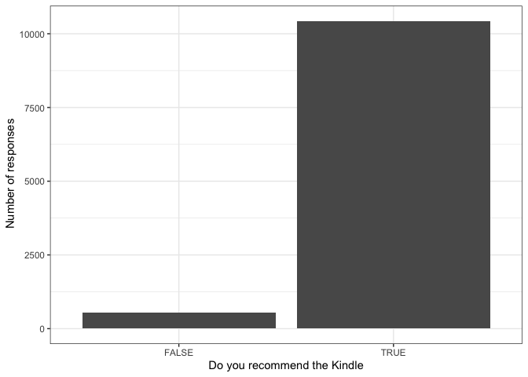
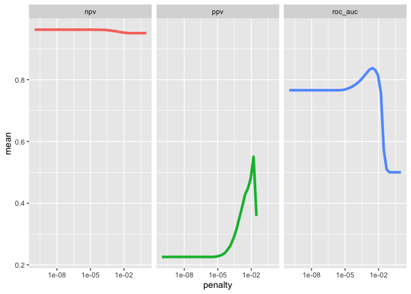
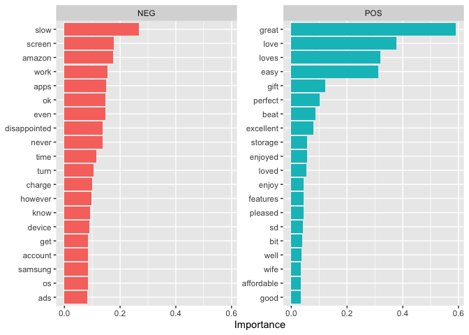
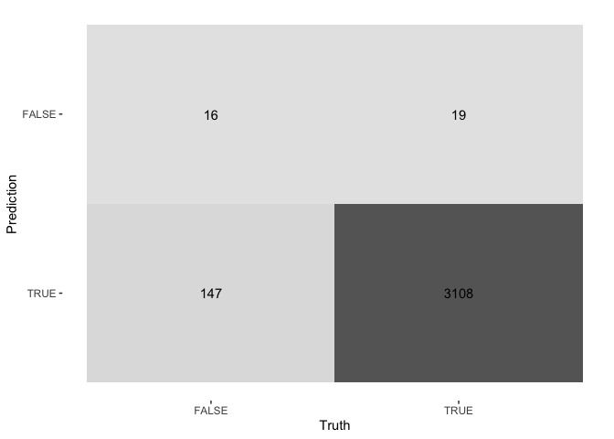

# Aim

The aim of this analysis is to show you which features of the product make it to be recommended. For this reason, I will pick only a product from the list and build a classification model. 


# Data

The data comes from Kaggle and it is about [Amazon store reviews](https://www.kaggle.com/datafiniti/consumer-reviews-of-amazon-products) for the Amazon Kindle tablet that it mainly used for reading eBooks. Since the data is available (and updated sometimes – this is the 7th version), you can easily replicate the analysis by yourself. The review dates start from 2015 and go through 2018. There are also 41 more products with varying degrees of review rate in the data set. For sentiment analysis of the same data, please visit my [previous post](https://aliunlu.com/en/amazon-product-review/) 


```r
#Required packages 
library <- c("tidytext", "tidyverse", "tidymodels", "textrecipes",
             "discrim", "textfeatures", "hardhat")
sapply(library, require, character.only = TRUE)
```

```
##     tidytext    tidyverse   tidymodels  textrecipes      discrim textfeatures 
##         TRUE         TRUE         TRUE         TRUE         TRUE         TRUE 
##      hardhat 
##         TRUE
```

In the first step, I only select Kindle from the product list.  There are also 41 more products in the data but the most reviewed one is Kindle, which is about 11.000 reviews. 

In the second step, I look at the distribution of the our outcome variable. The outcome variable is - reviews.doRecommend - which refers to whether the product is recommended or not. As seen in the bar chart, most of the reviewers recommeded the Kindle. 


```r
amazon <- read.csv("data/1429_1.csv")

# Just checking how balanced is our data.  It seems well balanced. 
amazon %>%
        filter(id=="AVphgVaX1cnluZ0-DR74") %>%
        ggplot(aes(reviews.doRecommend)) +
        geom_bar()+
        theme_bw()+
        labs(x= "Do you recommend the Kindle",
             y= " Number of responses")
```

<!-- -->

```r
# only select Kindle
product <- filter(amazon, id =="AVphgVaX1cnluZ0-DR74")
```

Finally, I will also set outcome variable and make sure it is factor. 


```r
# make sure about the outcome variable
levels(product$reviews.doRecommend)
```

```
## NULL
```

```r
# set the default
product$reviews.doRecommend<- as.factor(product$reviews.doRecommend)
levels(product$reviews.doRecommend)
```

```
## [1] "FALSE" "TRUE"
```


# Model

There are different approaches for this type of classification. For instance, we can include rating score or helpfulness
rates but I am interested in here only the review text. 

For the simplicity, I only select 500 words and I hope it is enough to produce satisfactory prediction. While I applied stopword filtering, I do not use stemming or lemmatization here. Based on the final output, you can increase the word numbers and apply other text manipulation techniques. 


```r
review_split <- initial_split(product, strata = reviews.doRecommend, prop = 0.70)
review_train <- training(review_split)
review_test <- testing(review_split)

# recipe 
review_rec <- recipe(reviews.doRecommend ~ reviews.text, data = review_train) %>%
        step_tokenize(reviews.text) %>%
        step_stopwords(reviews.text, stopword_source = "snowball", language = "en") %>%
        step_tokenfilter(reviews.text, max_tokens = 500) %>%
        step_tfidf(reviews.text) %>%
        step_normalize(all_predictors())

review_prep <- prep(review_rec)

review_prep
```

```
## Recipe
## 
## Inputs:
## 
##       role #variables
##    outcome          1
##  predictor          1
## 
## Training data contained 7676 data points and no missing data.
## 
## Operations:
## 
## Tokenization for reviews.text [trained]
## Stop word removal for reviews.text [trained]
## Text filtering for reviews.text [trained]
## Term frequency-inverse document frequency with reviews.text [trained]
## Centering and scaling for tfidf_reviews.text_1, tfidf_reviews.text_10, tf... [trained]
```

# Workflow

I also find quenteda package very useful and even faster for text classification but tidytext approach gives more tuning options. Depending on the data types, Naive Bayes and Random Forest also fits well for text classification but here I will test Lasso model. 

I will also use validation folds to determine the best prediction score.   


```r
####### workflow
lasso_spec <- logistic_reg(penalty = tune(), mixture = 1) %>%
        set_engine("glmnet")

lasso_wf <- workflow() %>%
        add_recipe(review_rec) %>%
        add_model(lasso_spec)

lasso_wf
```

```
## ══ Workflow ════════════════════════════════════════════════════════════════════
## Preprocessor: Recipe
## Model: logistic_reg()
## 
## ── Preprocessor ────────────────────────────────────────────────────────────────
## 5 Recipe Steps
## 
## • step_tokenize()
## • step_stopwords()
## • step_tokenfilter()
## • step_tfidf()
## • step_normalize()
## 
## ── Model ───────────────────────────────────────────────────────────────────────
## Logistic Regression Model Specification (classification)
## 
## Main Arguments:
##   penalty = tune()
##   mixture = 1
## 
## Computational engine: glmnet
```

```r
### tune
lambda_grid <- grid_regular(penalty(), levels = 40)

set.seed(123)
review_folds <- bootstraps(review_train, strata = reviews.doRecommend)
review_folds
```

```
## # Bootstrap sampling using stratification 
## # A tibble: 25 × 2
##    splits              id         
##    <list>              <chr>      
##  1 <split [7676/2823]> Bootstrap01
##  2 <split [7676/2814]> Bootstrap02
##  3 <split [7676/2793]> Bootstrap03
##  4 <split [7676/2810]> Bootstrap04
##  5 <split [7676/2822]> Bootstrap05
##  6 <split [7676/2811]> Bootstrap06
##  7 <split [7676/2798]> Bootstrap07
##  8 <split [7676/2834]> Bootstrap08
##  9 <split [7676/2874]> Bootstrap09
## 10 <split [7676/2889]> Bootstrap10
## # … with 15 more rows
```

```r
# model fit
doParallel::registerDoParallel()

#set.seed(2020)
lasso_grid <- tune_grid(
        lasso_wf,
        resamples = review_folds,
        grid = lambda_grid,
        metrics = metric_set(roc_auc, ppv, npv)
)
```

# Results

First, I will collect metrics and then plot the results to see which metric produce better outcomes. While ppv has a lower scores, npv is promising but for here I will continue with roc_auc. 


```r
# Once we have our tuning results, we can examine them in detail.

lasso_grid %>%
        collect_metrics()
```

```
## # A tibble: 120 × 7
##     penalty .metric .estimator  mean     n  std_err .config              
##       <dbl> <chr>   <chr>      <dbl> <int>    <dbl> <chr>                
##  1 1   e-10 npv     binary     0.962    25 0.000660 Preprocessor1_Model01
##  2 1   e-10 ppv     binary     0.226    25 0.00599  Preprocessor1_Model01
##  3 1   e-10 roc_auc binary     0.766    25 0.00442  Preprocessor1_Model01
##  4 1.80e-10 npv     binary     0.962    25 0.000660 Preprocessor1_Model02
##  5 1.80e-10 ppv     binary     0.226    25 0.00599  Preprocessor1_Model02
##  6 1.80e-10 roc_auc binary     0.766    25 0.00442  Preprocessor1_Model02
##  7 3.26e-10 npv     binary     0.962    25 0.000660 Preprocessor1_Model03
##  8 3.26e-10 ppv     binary     0.226    25 0.00599  Preprocessor1_Model03
##  9 3.26e-10 roc_auc binary     0.766    25 0.00442  Preprocessor1_Model03
## 10 5.88e-10 npv     binary     0.962    25 0.000660 Preprocessor1_Model04
## # … with 110 more rows
```

```r
# Visualization is often more helpful to understand model performance.

lasso_grid %>%
        collect_metrics() %>%
        ggplot(aes(penalty, mean, color = .metric)) +
        geom_line(size = 1.5, show.legend = FALSE) +
        facet_wrap(~.metric) +
        scale_x_log10()
```

<!-- -->

Finally, in this stage, I will pick the best results from 40 models we set in grid option above. Model 30 with 0.00273 penaly level produced the better prediction score for us. Then, I will apply this model to our first model.


```r
# Choose the final model
best_auc <- lasso_grid %>%
        select_best("roc_auc")
best_auc
```

```
## # A tibble: 1 × 2
##   penalty .config              
##     <dbl> <chr>                
## 1 0.00273 Preprocessor1_Model30
```

```r
final_lasso <- finalize_workflow(lasso_wf, best_auc)


final_lasso
```

```
## ══ Workflow ════════════════════════════════════════════════════════════════════
## Preprocessor: Recipe
## Model: logistic_reg()
## 
## ── Preprocessor ────────────────────────────────────────────────────────────────
## 5 Recipe Steps
## 
## • step_tokenize()
## • step_stopwords()
## • step_tokenfilter()
## • step_tfidf()
## • step_normalize()
## 
## ── Model ───────────────────────────────────────────────────────────────────────
## Logistic Regression Model Specification (classification)
## 
## Main Arguments:
##   penalty = 0.00272833337648676
##   mixture = 1
## 
## Computational engine: glmnet
```
# Sentiment

VIP package enable us to plot the more important words in terms of predicting the production recommendation. I divide words according to their positive and negative scores. For example, Kindle is not recommended because of its speed (slow), screen performance, probably its connection problem with google, adds, application issues (normally you cannat install) and even apple appears as a rival brand. 

On the other hand, price, size, simplicity and being a good gift idea make Kindle a recommended product. People reflect their strong emotions such as great, love, perfect, and excellent, show that Kindle satisfiy users' expectation very well.  


```r
############## sentiment
library(vip)
```

```
## 
## Attaching package: 'vip'
```

```
## The following object is masked from 'package:utils':
## 
##     vi
```

```r
final_lasso %>%
        fit(review_train) %>%
        extract_fit_parsnip() %>%
        vi(lambda = best_auc$penalty) %>%
        group_by(Sign) %>%
        top_n(20, wt = abs(Importance)) %>%
        ungroup() %>%
        mutate(
                Importance = abs(Importance),
                Variable = str_remove_all(Variable, 'tfidf_reviews.text_'),
               Variable = fct_reorder(Variable, Importance)
        ) %>%
        ggplot(aes(x = Importance, y = Variable, fill = Sign)) +
        geom_col(show.legend = FALSE) +
        facet_wrap(~Sign, scales = "free_y") +
        labs(y = NULL)
```

<!-- -->

# Final review

With a sufficient coding efforts, I produced pretty good results. The accuracy score is 0.950 and roc acuracy is 0.872. As stated above, with more words and trying stemming and lemmatization manipulations, the accuracy might be increased. It is also worth to test other models, such as randon forest. 


```r
######### final review
review_final <- last_fit(final_lasso, review_split)

review_final %>%
        collect_metrics()
```

```
## # A tibble: 2 × 4
##   .metric  .estimator .estimate .config             
##   <chr>    <chr>          <dbl> <chr>               
## 1 accuracy binary         0.950 Preprocessor1_Model1
## 2 roc_auc  binary         0.872 Preprocessor1_Model1
```

```r
# matrix
review_final %>%
        collect_predictions() %>%
        conf_mat(reviews.doRecommend, .pred_class) %>%
        autoplot(type = "heatmap")
```

<!-- -->


